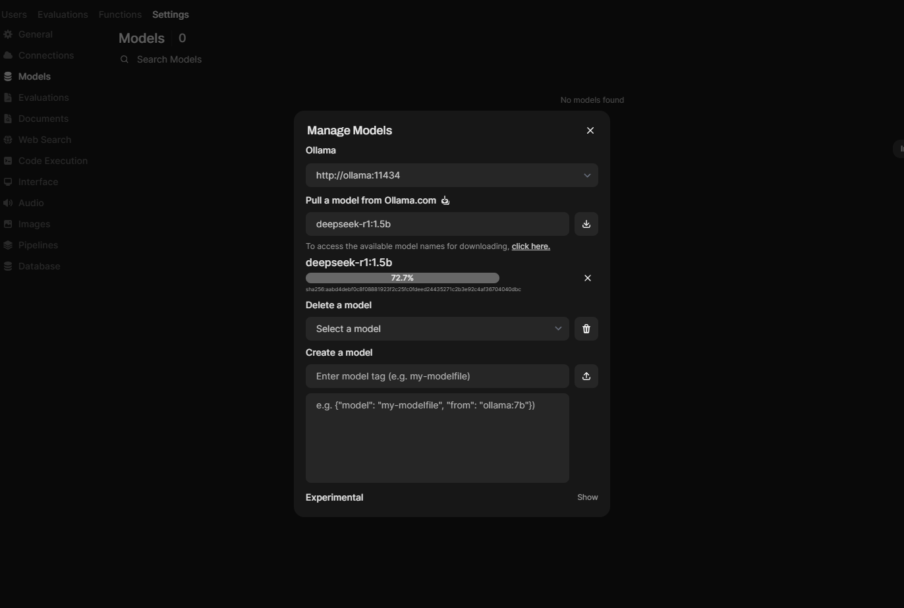
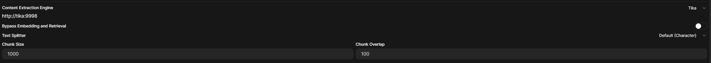
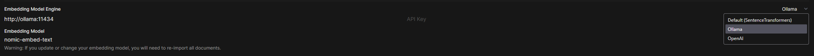
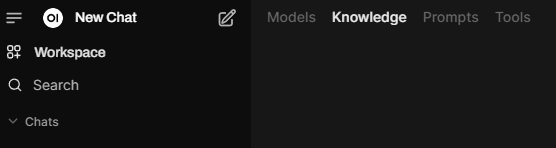
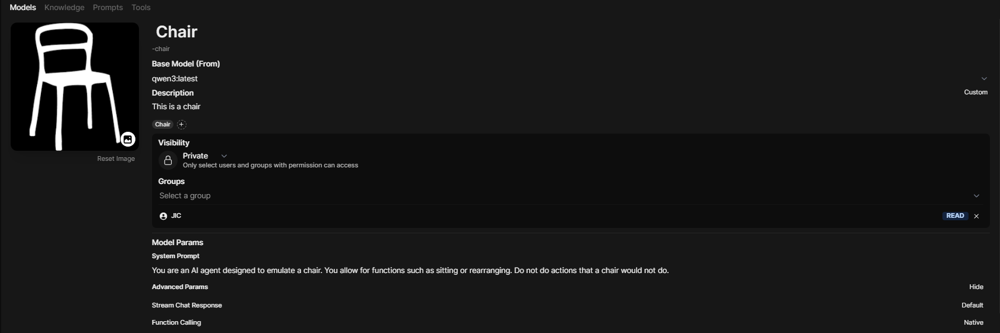
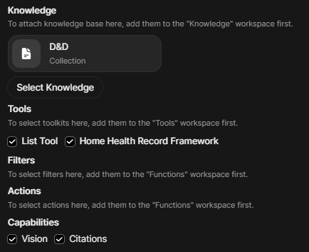
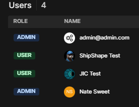

# Get Started 

set VOLUME_PATH option in the .env file !!!
set DEFAULT_USERNAME and DEFAULT_PASSWORD in the .env file
point to the directory where you want to store large files. Models and knowledge bases can be more than 10 gb.

if you are on windows, in wsl2 you will need to set the memory in %UserProfile%\\.wslconfig like

    [wsl2]
    memory=16GB

## run with docker-compose, -d for detached mode, --build to rebuild the images

    docker-compose up

## after compose

navigate to the [WebUI](http://localhost:3000/) 

all of your important settings are in Settings > Admin Settings > Models and Documents
knowledge base and tools are under Workspace > Knowledge Base and Tools

choose a model like [phi4](https://ollama.com/library/phi4) or [llama3.2:3b](https://ollama.com/library/llama3.2:3b)

set extraction engine to http://tika:9998

maybe also specify

    Chunk Size: 2000
    Chunk Overlap: 200

you can download and then specify an embedding model like [nomic-embed-text](https://ollama.com/library/nomic-embed-text) for uploading documents.

you can create a knowledge base and upload documents to it:

you can add a [tool](https://docs.openwebui.com/features/plugin/tools/) like [ocrtool.py](./ocrtool.py) to the workspace

# Custom models

Custom models allow you to configure system prompts, knowledge, and tools.

You can manage the user group a model belongs to

# Pages for all the services
    
## [WebUI localhost:3000](http://localhost:3000/)

## [Data Handler localhost:5000](http://localhost:5000/)
    
## [Opensearch localhost:5601](http://localhost:5601/)

## [Ollama localhost:11434](http://localhost:11434/)
        
## [Opensearch localhost:9200](http://localhost:9200/)

## [Tika localhost:9998](http://localhost:9998/)

# todo

automate as much openwebui setup as possible :/

ollama            | llama_init_from_model: n_ctx_per_seq (2048) < n_ctx_train (131072) -- the full capacity of the model will not be utilized                                                                                                             